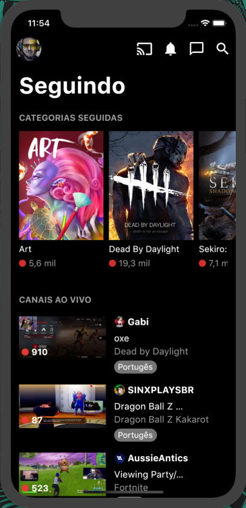
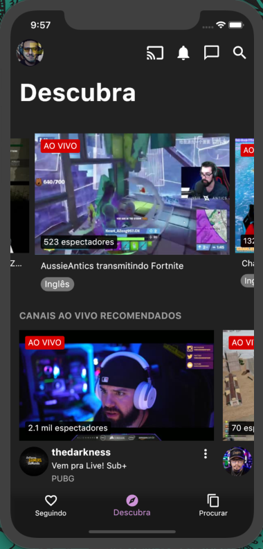
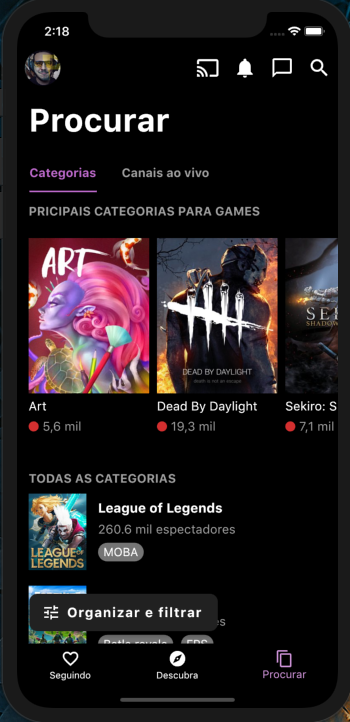
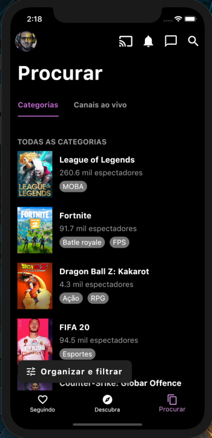
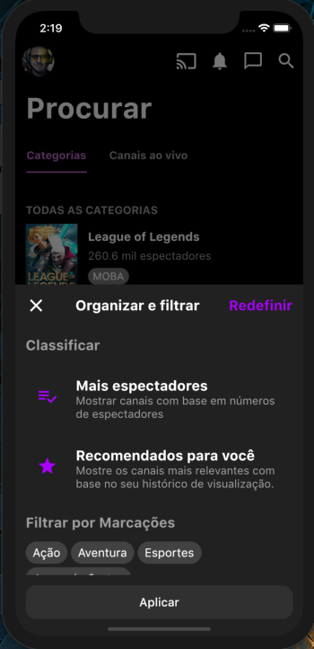
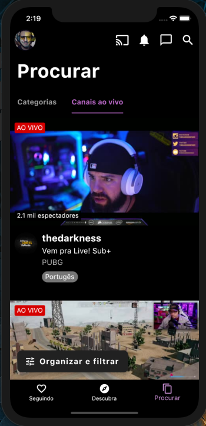
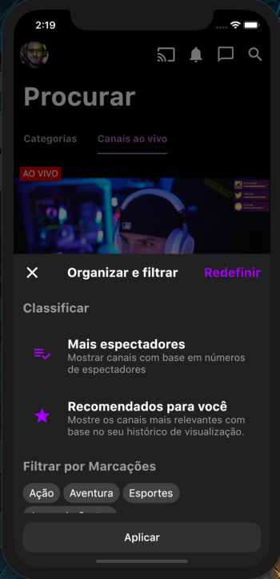

# twitch_flutter_UI

Design do App Twitch(mobile feito em Flutter.
 

  
 
 
 
 
 
 
 
 
 
 

   
 
 
# O App aborda:

UI Design

    • Containers decorations
  
    • ListView.
    
    • Caroussel Slider.
  
    • Custom Widgets
  
    • InkWell em imagem
    
    • Bottom Navigation
    
    • BottomSheet
    
    • TabBar
    
    • Custom FloatingActionButton
